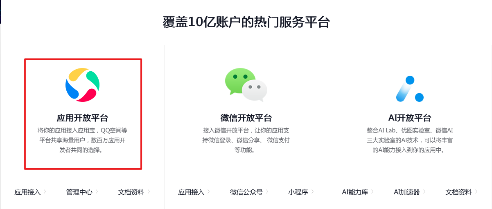
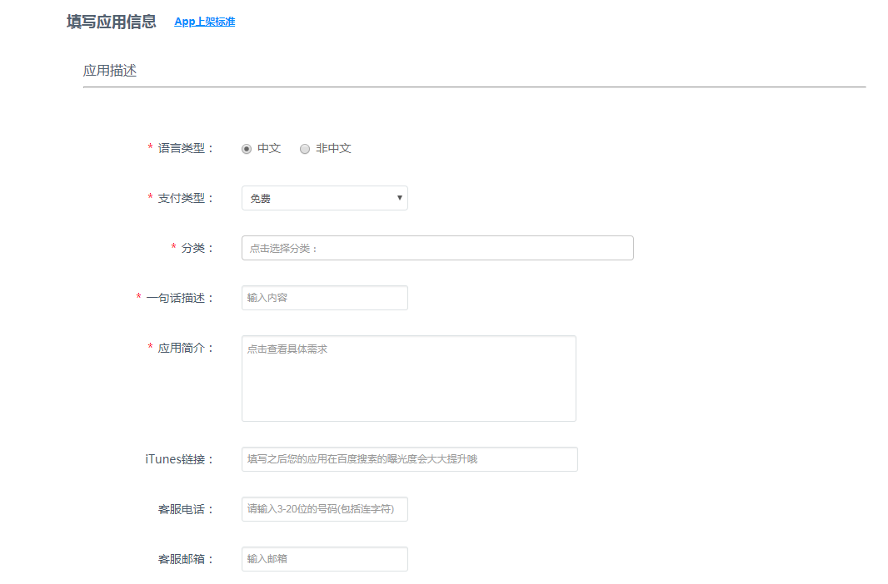

# 移动端App上架流程

## Android端
* ***整体流程概览***  
* ***应用市场***
	* 腾讯应用宝[^https://sj.qq.com]
	* 百度手机助手[^https://app.baidu.com]
	* 360手机助手[^https://dev.360.cn]
	* Vivo应用商店[^https://dev.vivo.com.cn/home]
	* OPPO应用商店[^https://open.oppomobile.com]
	* 小米应用商店[^https://dev.mi.com/console/]
	* 华为应用市场[^https://developer.huawei.com/consumer/cn/]
	* 安智市场[^https://dev.anzhi.com]
	* 锤子应用[^https://dev.smartisan.com]
	* 阿里开放平台（豌豆荚）[^https://open.uc.cn]

<h2>腾讯应用宝</h2>

* ***账号准备***
	* 点击腾讯开放平台[^https://open.tencent.com],选择相应平台  
	* 登录后，选择注册开发者类型（个人/公司），填写相关资料，验证邮箱后即完成注册
	* 提交资质审核，若需要接入支付与平台结算功能，还需要提供银行信息
* ***详细过程***
	* 选择应用类型  
	* 选择平台  
	* 选择应用类型   
	* 填写基本信息  
	* 上传安装包并选择发布时间  
	* 上传图标素材、应用截图和视频  
	* 选择设备适配信息  
	* 提供版权证明（已经必须提交）  
* ***发布流程***
	* 完成上面步骤之后，直接提交审核  
	* 若应用不对外开放注册，需要在版权证明处提供测试账号和密码

<h2>百度</h2>

* 准备材料
	* 开发者资料
		* 企业单位（营业执照）
	* 应用提交时的信息
		* 必填信息
			* 安装包
			* 应用icon 512*512，小于800K、 JPG或PNG格式、圆角清晰透明、无白边
			* 应用介绍
			* 应用截图 800px*480px 、小于2MB、4-6张 JPG或PNG格式、清晰、顶部通知栏无图标
			* 一句话介绍
		* 选填信息
			* 更新说明/更新辅助/官网地址/客服电话
	* 游戏类必须提供软件著作权登记证书
	* 特定应用需要的资质文件[^   ]
	* App描述文件规范[^  ]
	* 功能、内容规范[^  ]
	* 不收录App类型[^  ]

* 应用提交详细步骤		
	* 首页→发布应用
	* 选择应用类型（App/游戏）
	* 填写应用信息、版权资质（附录5）[^    ]

* 常见问题
	* 线上显示名称直接匹配安卓安装包的名称
	* 测试账号在审核辅助说明中提供
	* 对机型或者CPU有特殊要求在审核辅助说明中提供
	* 应用更新审核时间为1到3个工作日
	* 修改内容后，审核通过后覆盖线上应用

<h2>360</h2>

* 准备材料
	* 开发者资料
		* 企业单位（营业执照）
	* 基本信息
		* 应用名称
		* 应用介绍
		* logo图标（512*512，圆角清晰透明、无白边）
		* 应用截图（顶部通知栏无图标，四张以上、清晰、不小于800px*480px）
		* 资质文件、收录标准[^http://dev.360.cn/wiki/index/id/18]
	* 未硬性要求版权证明

* 应用提交详细步骤
	* 首页→软件发布
	* 选择应用类型（软件/电子书）
	* 填写软件信息、图标和截图、审核发布设置[^  ]

* 常见问题
	* 应用名称识别中英文且无符号
	* 定时发布无时间限制
	* 测试账号在审核辅助说明中提供
	* 对机型或者CPU有特殊要求在审核辅助说明中提供
	* 应用提交、更新、版本回退后，24小时内会进行审核
	* 修改内容后，审核通过2小时会覆盖线上应用
	* ...

<h2>一些问题</h2>

* ***apk安装包的包内容概览***
	* /assets
		* 静态文件
	* /META-INF
		* 签名证书
		* 文件的哈希值计算结果
	* /res
	* /AndroidManifest.xml
		* 包名
		* 数据权限
		* 接口权限
		* 版本信息
		* 安装参数
		* ...
	* /classes.dex
		* 可在安卓的Dalvik虚拟机中直接运行的字节码
	* /lib
		* app依赖的库		
	* 不能直接看到的内容
		* 反编译

* ***渠道包***
	* 概念
		* 主要用于第三方sdk统计数据（如友盟）的需求而产生。不同的安卓市场需要不同的渠道名称，从而需要针对每一个市场单独进行打包，这样第三方数据统计分析才有据可依（应用在请求网络的时候携带渠道信息，方便后台做运营统计）
		* 如果未接入第三方数据统计，或者不需要进行多平台的数据对比，就可以直接使用正式包，而不进行多渠道打包
		* 一般来讲，渠道的标识会放在AndroidManifest.xml的Application的一个Metadata中
	* 实际操作（多渠道打包方案）
		* （使用Android Gradle Plugin为例）集成友盟数据统计+多渠道打包
			1. 导入sdk 在gradle依赖中添加  
			2. 修改AndroidManifest.xml，添加权限、Appkey和渠道ID
				*  "YOUR_APP_KEY"替换为申请友盟的Appkey "Channel ID"替换为推广渠道的名称(自定义) 比如豌豆荚市场  
				* 多渠道的情况
					* 先将上面的Channel ID用占位符代替 
					* Channel ID → ${UMENG_CHANNEL_VALUE}
			3. 修改build.gradle
				* android{}下的defaultconfig{}下添加默认渠道号  					
				* 同级节点即anddroid{}下添加productFlavors节点  这样在productFlavors里面的每一个市场都会打包一个apk

			4. 打包
				* 测试包 gradlew assembleDebug
				* 正式包 gradlew assembleRelease
				* 成功打包后的文件路径 /yourProject/build/outputs/apk

* Android数字证书要点归纳
	* 所有的应用程序都需要数字证书，Android系统不会安装没有数字证书的App
	* 使用合适的私钥生成的数字证书（自签名）就可以，不需要任何机构认证
	* 数字证书包含了所有者姓名，所属组织，国家，证书创建及过期时间等信息
	* Java工具Keytool和Jarsigner可以用于生成数字证书，给程序包签名
		* APICloud就是用这种方式生成签名
		* 其他：Android ADT、ANT
	* 不同的应用程序包可以使用一个数字证书来签名
	* 包名相同但是签名不同的安装包Android系统不会覆盖（App已经上线的情况下，更新数字签名会导致，升级时新的安装包被认为具有“非法签名”，从而导致无法更新）
	* 数字证书是一个有效期，Android只是在应用程序安装的时候才会检查证书的有效期。如果程序已经安装在系统中，即使证书过期也不会影响程序的正常功能

* 数字证书的理论基础
	* 对称加密
		* 加密和解密都使用同一个密钥，即单密钥加密
		* 常用算法
			* AES/DES/DES3/TDEA/Blowfish/RC2、4、5...
		* 应用场景
			* 类似密码的管理的App，不同的账号密码组合被存储由App管理，用户只需要记住一组账号密码，就可以加密和还原自己的其他账号密码信息
			* 传输敏感数据时，使用对称加密，而服务器端使用相同的算法就可以解密，反之亦然

	* 非对称加密
		* 需要一对密钥（公钥、私钥）
		* 如果用公钥对数据进行加密，只有用对应的私钥才能解密；如果用私钥对数据进行加密，那么只有用对应的公钥才能解密，这种加密解密时用不同的密钥，即是非对称加密
		* 非对称加密的速度较对称加密慢
		* 常见算法
			* RSA/Elgamal/Rabin/DH(Diffie-Hellman)/ECC...
		* 应用场景
			* 身份认证 如果一条密文能用某一个公钥解密，则一定是由相应的私钥进行加密的，从而确定该人的身份
			* 加密通信 两个用户通过交换公钥，就可以进行加密的通信，即使第三者获取了公钥，也不会有影响
			* 私钥交换 A已有B的公钥，A自己生成一个随机密钥，然后用B的公钥加密，得到密文，发送给B，B收到后用自己的私钥解密，得到A生成的随机密钥。通过这个随机密钥实现了对称加密的通信

	* 数字摘要
		* 根据一定的运算规则对原始数据进行某种形式的信息提取，被提取出的信息就是原始数据的消息摘要，也称为数据指纹
		* 相同的原始数据必有相同的数据摘要，不同的原始数据，其数据摘要也必然不同
		* 不可逆：只能正向提取原始数据的数据摘要，而无法从数据摘要中恢复出原始数据
		* 常见算法
			* MD5/SHA/CRC
		* 应用场景
			* 对用户密码进行md5加密后存储到数据库
			* 网路上，下载文件时，计算文件摘要，防止下载的文件被篡改
			* 数字签名（Android和iOS都用了）
			* 计算摘要形成特征码，整理在数据库后，可进行比对验证，比如病毒的验证

