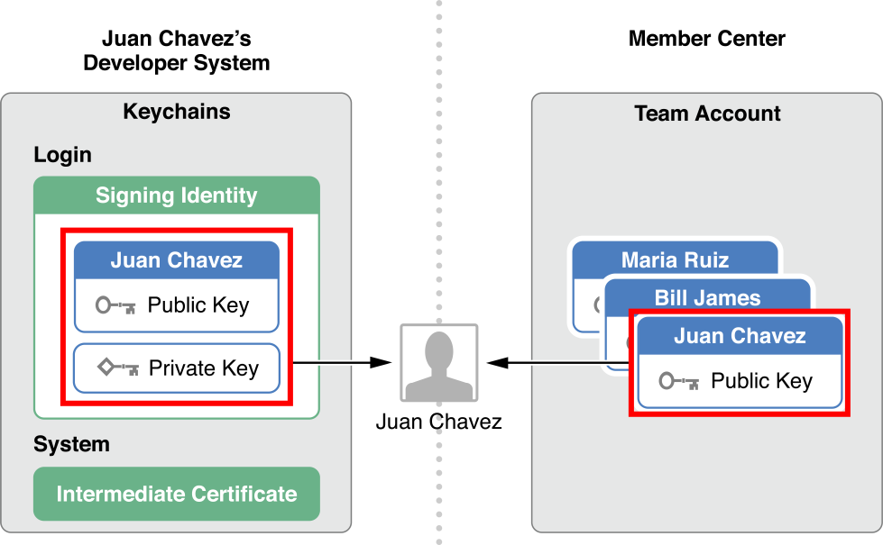

# 移动端App上架流程

## iOS端
* ***整体流程概览***  
* ***账号准备***
	* 苹果开发者账户[^https://developer.apple.com]
		* iOS Developer Program
* ***详细过程***
	* 证书申请
		* 登录开发者账号，进入管理菜单   
		* Development证书、Production证书  
		* APICloud官方证书文档[^https://docs.apicloud.com/Dev-Guide/iOS-License-Application-Guidance] 

	* 创建APP IDs  
	* 描述文件
		* 配置描述文件Provisioning Profile，记录了包括类型、证书、App ID和调试设备的信息
	* 打包ipa（APICloud内打包）
* ***发布流程***
	* iTunes Connect[^https://itunesconnect.apple.com]
		* 新建App
		* 填写App综合信息、审核信息
	* 提交ipa
		* Xcode中直接打包上传/内置Application Loader上传
		* 第三方软件打包上传
	* 上传后，进入iTunes Connect查看项目构建状态  
	* 选择构建版本后，提交等待审核

* ***几个重要的概念和一些需要注意的点***

* ***Application Loader的使用***
	* 在iTunes Connect上把App添加到账户后，就可以将App的二进制文件即ipa/pkg文件交付到App Store
	* 登录后上传打包好的ipa文件 验证信息示例  
	* 然后直接上传等待iTunes Connect的响应
	* 点击活动即可查看交付中的警告以及错误信息
		* Invalid Binary（二进制文件无效）
			* 比如图标不符合要求

		* Redundant Binary Upload
			* 已经上传这一版本的包，可以将版本号提高后再次上传

		* 版本号不对
			* 版本号必须为3个非负整数的句点连接格式

		* 网络问题
		* Invalid Executable Size
			* 可执行二进制文件大小限制

		* ...

* ***信息填写时注意的地方***
	* iTunes Connect
		* 新建App
			* 名称（显示在App Store的名称）
			* 套装ID（即bundle ID）
			* SKU 为App指定的用于内部跟踪的唯一ID，此ID对顾客不可见。SKU可以包含字母、数字、连字符、英文句号和下划线，但不能以连字符、英文句号或下划线开头。您将该 App添加至您的帐户后，便不能再更改SKU

		* 版本信息
			* App预览、屏幕快照
				* 最多3个预览（可选）和10张快照
				* 对于iphone，必须提交5.5英寸设备的快照
			* 描述：4000字以内的文字描述
			* 关键词（每个关键词包含两个以上字符，最多100字节，英文逗号隔开，App Store搜索相关）
			* 技术支持URL
			* 营销URL（可不填）
		* App综合信息
			* App图标（即显示在App Store的图标）
				* 分辨率：1024*1024
				* 格式：jpg/png
				* \>=72DPI 
				* RGB色彩空间
				* 不包含图层和圆角

		* 最大构建版本大小
			* App的完整未压缩大小不得超过4GB
			* 最大可执行文件大小  
		* 参考：必填、本地化、可编辑的信息[^    ]

* ***常见的审核问题***
	* 对于有用户生成内容的App，即用户可以发布内容，要有对应的举报屏蔽机制
	* 为提供测试账号
	* 屏幕快照不一定要是原始截图，可以有适当的加工美化，如果相差较大会被拒绝
	* 使用和系统接近的图标
	* ...

* **App IDs**
	* App ID就是Product ID，标识一个（Explicit）或者一组App（Wildcard）
	* App ID应该与Xcode（或者项目）的Bundle Identifier是一致（Explicit）或者匹配（Wildcard）的 **使用Explicit ID时Game Center、In-App Purchase是默认开启的**
	* App ID字符串通常是反域名格式的Company Identifier（Company Id）
	* App ID全名会被追加Application Identifier Prefix（一般是Team ID）

	
* **证书**
	* 准备工作：CSR文件
		* 手动生成证书，需要先从Mac上生成一个CSR文件 （钥匙串工具→证书助理→从证书颁发机构请求证书→填写email和私钥名、CA留空→存储到磁盘）
		* CSR文件生成后，自动生成一对公私钥，private key储存在电脑中，而所请求的证书就是key pair的public那一半
		* 生成不同证书的时候（开发、发布），是从同一个CSR文件还是不同CSR文件来生成证书呢？ 理论上说，并不是一定需要对Development和Distribution用不同的私钥来管理。但是应该这样做。开发测试时，不同的人需要具有这个权限来完成开发。但是对于发布来讲，属于生产环境，跟开发是不同的，所以最好是用两个不同的私钥
	* 数字证书
		* 数字证书就是一个经过证书授权中心（CA）数字签名的包含公开密钥拥有者信息以及公开密钥的文件 （最简单的构成：公开密钥 + 名称 + CA的数字签名）
		* 数字证书具有时效性（会过期）
		* 根证书是CA给自己颁发的证书，即信任链的起点，安装根证书意味着对这个CA认证中心的认可
	* iOS证书
		* Development证书，用于开发和调试程序
		* Distribution（Production）证书，用于分发应用程序，根据种类有不同的作用，最常见的就是submit到App Store
		* 普通个人开发账户最多可以注册这两类证书各两个，
		* iOS证书的根证书（AppleWWDRCA.cer）
		* 上面创建CSR文件的过程中，就已经在Keychain | keys中新增了一对public/private key pair，private key始终保存在Mac中，用于签名（CodeSign）对外发布的App；public key一般随着证书（Provisioning Profile）发布出去，对App签名进行校验认证。在Developer中心申请好证书并安装在Mac上后，Keychain|keys的对应公私钥下已经能看到证书的信息，反之一样

* **Provisioning Profiles**
	* 包含了App ID、证书以及设备  
	* Provisioning Profiles就决定了哪个证书（也即key pair组合）来签署应用程序，打包时会嵌入到.ipa包中
	* 安装应用程序时，文件被拷贝到iOS设备中，设备也通过这个文件来完成认证
	* 也分为Development和Distribution两类
	* 文件构成
		1. Name: mobileprovision的文件名
		2. UUID：真实文件名
		3. TeamName：Apple ID账号名
		4. TeamIdentifier
		5. AppIDName：Explicit/Wildcard App ID name
		6. ApplicationIdentifierPrefix：完整的App ID前缀
		7. DeveloperCertificates
		8. Entitlements
		9. ProvisionedDevices

* **签名、证书、详细校验过程**
	* Xcode中的Code Signing Identity
		* Xcode中配置的Code Signing Identity（entitlements、certificate）必须与Provisioning Profile匹配，并且配置的Certificate必须在本机Keychain Access中存在对应Public／Private Key Pair，否则编译会报错

		* Xcode所在的Mac使用CA证书（AppleWWDRCA.cer）来判断Code Signing Identity中Certificate的合法性
			1. 若用WWDRCA公钥能成功解密出证书并得到public key和内容摘要（signature），证书来源可信
			2. 再对证书本身使用哈希算法计算摘要，若和上面得到的摘要一致，则证书是完整未被篡改的
		*    

	* Code Signing
		* 证书对应的私钥用来对内容进行数字签名（CodeSign），即使用哈希算法生成内容摘要
	* 在App上实际启动时的过程
		* 在Mac/iOS上启动时，首先对配置的bundle ID、entitlements、Certificate和Provisioning Profile进行匹配校验
		* Mac/iOS上的ios_development.cer被AppleWWDRCA.cer中的 public key解密校验合法后，获取每个开发证书中可信任的公钥对App的可靠性和完整性进行校验 具体校验过程同上面Xcode过程类似：
			1. 若用证书公钥能成功解密出App（executable code）的内容摘要（Signature），证明此App确乃认证开发者发布，即来源可信
			2. 再对App（executable code）本身使用哈希算法计算摘要，若与上一步得到的摘要一致，则证明此App（executable code）未被篡改过，即内容完整
				
			 
			
		